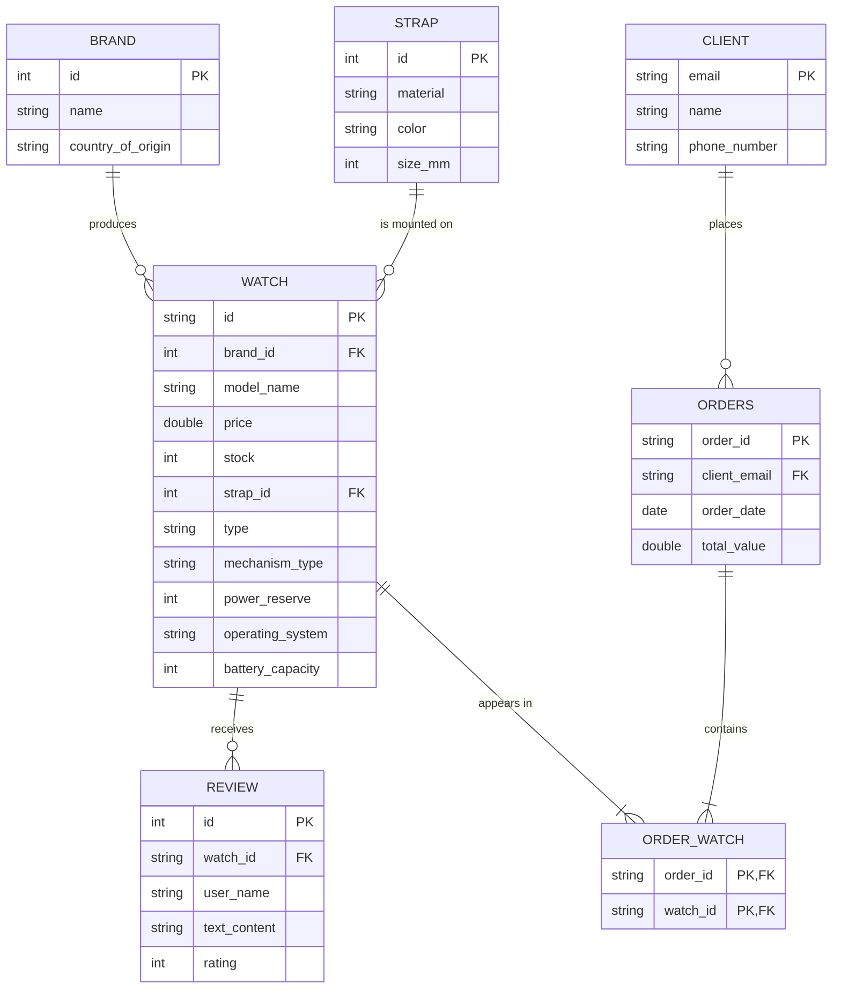

# ERD Diagram - CoffeeWatch

Below is the relational representation of the database using Mermaid syntax.

## Relationship Explanation:
1.  **Brand -> Watch**: A brand can produce multiple watch models (1:N).
2.  **Strap -> Watch**: A strap can be used for multiple watches (1:N).
3.  **Watch -> Review**: A watch can have multiple reviews from different users (1:N).
4.  **Client -> Orders**: A client can place multiple orders over time (1:N).
5.  **Orders -> Watch (M:N)**: An order can contain multiple watches, and a watch can appear in multiple orders. This is achieved through the `Order_Watch` link table.
