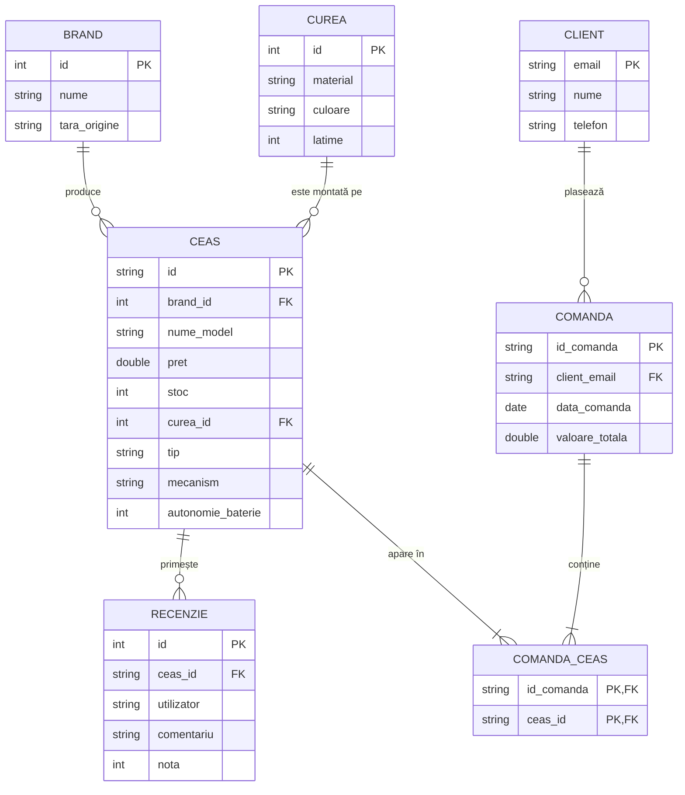

# Diagrama ERD - CoffeeWatch

Mai jos este reprezentarea relațională a bazei de date utilizând sintaxa Mermaid.

## Explicație Relații:
1.  **Brand -> Ceas**: Un brand poate produce mai multe modele de ceasuri (1:N).
2.  **Curea -> Ceas**: O curea poate fi folosită pentru mai multe ceasuri (1:N).
3.  **Ceas -> Recenzie**: Un ceas poate avea mai multe recenzii de la utilizatori diferiți (1:N).
4.  **Client -> Comanda**: Un client poate plasa mai multe comenzi în timp (1:N).
5.  **Comanda -> Ceas (M:N)**: O comandă poate conține mai multe ceasuri, iar un ceas poate apărea în mai multe comenzi. Aceasta este realizată prin tabela de legătură `Comanda_Ceas`.
